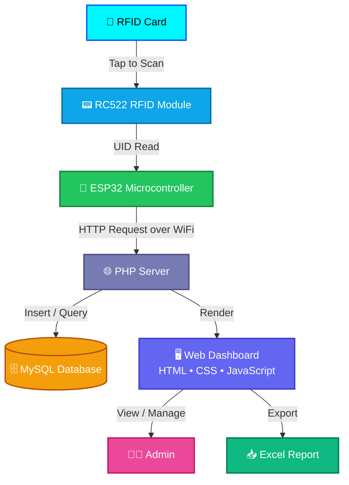
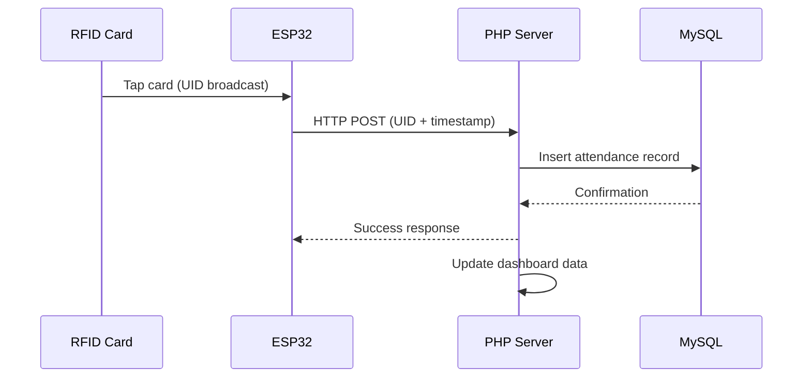

<p align="center">
  
</p>

<p align="center">
  🚀 <strong>Smart</strong> | <strong>Contactless</strong> | <strong>IoT-Based</strong> Attendance Tracking System
</p>

<p align="center">
  
  
  
  
  
  
</p>

---

# 📡 RFID Attendance System using PHP & ESP32

A complete **RFID-based Attendance Management System** integrated with **ESP32, PHP, and MySQL** for real-time attendance tracking. Attendance is recorded automatically the moment an RFID card is scanned, and instantly reflected on a live web dashboard.

---

## 📌 Description

This project is an IoT-based attendance system where RFID cards are used to mark attendance. The **ESP32** reads the RFID UID and sends it to a **PHP** server over HTTP. The backend stores the data in a **MySQL** database and displays it through a clean web interface — eliminating manual attendance and ensuring accuracy, speed, and security.

---

## ✨ Features

| Category | Details |
|---|---|
| 📡 **RFID Scanning** | Instant UID capture via ESP32 + RC522 module |
| ⚡ **Real-Time Updates** | Attendance reflected on the dashboard the moment a card is scanned |
| 🗓️ **Date & Time Logging** | Every scan is timestamped automatically |
| 👨‍💼 **Admin Login** | Secure authentication for system administrators |
| 👥 **User Management** | Add, update, and manage registered users |
| 📊 **Attendance Logs** | Searchable, filterable attendance history |
| 📥 **Excel Export** | One-click export of attendance records |
| 🌐 **Web Dashboard** | Responsive HTML/CSS/JS interface |

---

## 🧠 System Architecture



### 🔄 Attendance Flow



---

## 🛠️ Tech Stack

<table>
<tr>
<td valign="top" width="50%">

### 🔌 Hardware
- 🔧 ESP32 microcontroller
- 📟 RFID Module (RC522)

### ⚙️ Backend
- 🐘 PHP
- 🐬 MySQL

</td>
<td valign="top" width="50%">

### 🎨 Frontend
- 🌐 HTML / CSS / JavaScript

### 🖥️ Server
- 🧰 XAMPP / WAMP

</td>
</tr>
</table>

---

## 🧠 How It Works

1. 📇 RFID card is scanned
2. 🔧 ESP32 reads the UID
3. 📡 UID is sent to the PHP server via HTTP
4. 🗄️ PHP stores the data in the MySQL database
5. 📊 Attendance is displayed on the dashboard in real time
6. 👨‍💼 Admin can manage users and export data

---

## 📂 Project Structure

```
RFID-Attendance-System/
├── index.php
├── login.php
├── logout.php
├── connectDB.php
├── getdata.php
├── UsersLog.php
├── ManageUsers.php
├── Export_Excel.php
├── devices.php
├── header.php
├── dev_config.php
├── dev_up.php
├── ac_login.php
├── ac_update.php
├── manage_users_conf.php
├── manage_users_up.php
├── user_log_up.php
├── install.php
├── rfidattendance.sql
├── esp32_code/
└── README.md
```

---

## ⚙️ Setup Instructions

### 🔧 1. Clone the Repository

```bash
git clone https://github.com/Biswajitpa/rfid-attendance-system.git
cd rfid-attendance-system
```

### 🗃️ 2. Set Up the Database

- Open **phpMyAdmin**
- Create a new database
- Import `rfidattendance.sql`

### ⚙️ 3. Configure the Database Connection

Edit `connectDB.php`:

```php
$servername = "localhost";
$username = "root";
$password = "";
$dbname = "your_database_name";
```

### 🌐 4. Run the Project

- Start **XAMPP / WAMP**
- Place the project folder inside `htdocs`
- Open in your browser:

  👉 `http://localhost/rfid-attendance-system`

---

## 🔌 ESP32 Integration

1. Open and upload the code from `esp32_code/`
2. Update your **WiFi credentials** and **server URL** in the sketch
3. Wire the **RC522 RFID module** to the ESP32
4. Scan a card → data is sent to the server automatically

---

## 📈 Future Enhancements

- 📱 Mobile app integration
- ☁️ Cloud database (Firebase / AWS)
- 🔔 Email / SMS alerts on attendance
- 📊 Advanced analytics dashboard

---

## 🤝 Contribution

Contributions are welcome! Feel free to fork this repository, open issues, and submit pull requests to help improve the project.

---

## 📜 License

This project is licensed under the **MIT License**.

---

## 👨‍💻 Author

<div align="center">

### 🧑‍💻 Biswajit Pattanaik
**Embedded Systems | IoT Developer**

*From wiring an RC522 to a microcontroller to building the web dashboard that displays the data in real time, this project reflects a full end-to-end IoT build — hardware, firmware, backend, and UI all working together seamlessly.*

`ESP32` `RFID` `PHP` `MySQL` `IoT`

🔗 GitHub: [github.com/Biswajitpa](https://github.com/Biswajitpa)

</div>

---

<p align="center">
  ⭐ If this project helped you, consider starring the repo and sharing it with fellow developers! 🚀
</p>
